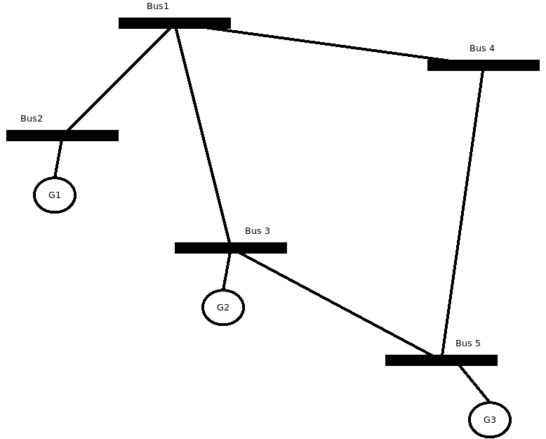

Connectivity Matrix
====================

This section explains how to build a CSC connectivity matrix directly with no intermediate LIL matrix.

The connectivity matrix is as follows:

+----+------+------+------+------+------+
|    | Bus1 | Bus2 | Bus3 | Bus4 | Bus5 |
+====+======+======+======+======+======+
| G1 |      | 1    |      |      |      |
+----+------+------+------+------+------+
| G2 |      |      | 1    |      |      |
+----+------+------+------+------+------+
| G3 |      |      |      |      | 1    |
+----+------+------+------+------+------+

This matrix in CSC format is:

indptr =  [0, 0, 1, 2, 2, 3]

indices = [0, 1, 2]

data =    [1, 1, 1]

The following code exemplifies the concept of building a CSC connectivity matrix directly.

.. code-block:: python

    import numpy as np
    from CSparse3.csc import CscMat

    # declare the Bus class
    class Bus:
        def __init__(self, name, gen):
            self.name = name
            self.gen = gen

    # declare the generator class
    class Gen:
        def __init__(self, name, p=0):
            self.name = name
            self.p = p

    # build the example
    buses = [Bus('Bus1', []),
             Bus('Bus2', [Gen('G1', 10)]),
             Bus('Bus3', [Gen('G2', 20)]),
             Bus('Bus4', []),
             Bus('Bus5', [Gen('G3', 30)])]

    # count the elements to declare the matrices
    ng = 0
    nb = len(buses)
    for b in buses:
        ng += len(b.gen)

    # declare the connectivity matrix
    gen_conn = CscMat(ng, nb, nz_max=ng)
    p = np.zeros(ng)
    gi = 0  # this is the total generator counter
    for i, b in enumerate(buses):
        for k, g in enumerate(b.gen):
            gen_conn.indices[gi] = gi  # store the row indices
            gen_conn.data[gi] = 1  # set the value
            p[gi] = g.p
            gi += 1

        gen_conn.indptr[i + 1] = gi  # store the column pointer when the bus changes

    gen_conn.indptr[nb] = gi  # store the last column pointer

    print('Generator-Bus connectivity matrix')
    print(gen_conn.todense())

    print('indptr = ', gen_conn.indptr)
    print('indices = ', gen_conn.indices)
    print('data = ', gen_conn.data)

    print('Bus power injections')
    print(gen_conn.t() * p)

The output is the following:

.. code-block:: text

    Generator-Bus connectivity matrix
    [[0. 1. 0. 0. 0.]
     [0. 0. 1. 0. 0.]
     [0. 0. 0. 0. 1.]]

    indptr = [0 0 1 2 2 3]

    indices = [0 1 2]

    data = [1. 1. 1.]

    Bus power injections
    [ 0. 10. 20.  0. 30.]